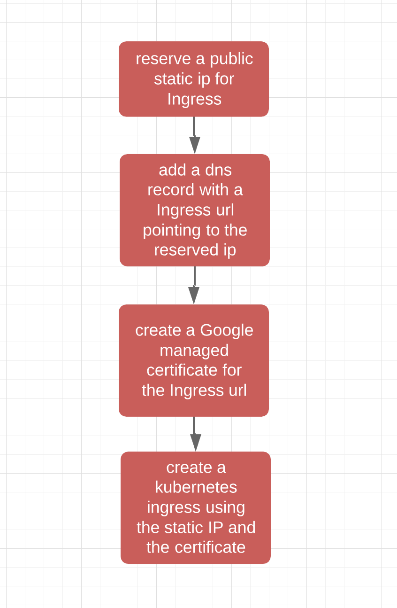

# Building Managed Certificates for your Kubernetes Engine Cluster

## Table of Contents
<!-- TOC -->
  * [Introduction](#introduction)
  * [Process](#process)
  * [Assumptions](#assumptions)
  * [Prerequisites](#prerequisites)
    + [Cloud Project](#cloud-project)
    + [Required GCP APIs](#required-gcp-apis)
    + [Install Cloud SDK](#install-cloud-sdk)
    + [Install kubectl CLI](#install-kubectl-cli)
    + [Install Kustomize](#install-kustomize)
    + [Install Terraform](#install-terraform)
    + [Configure Authentication](#configure-authentication)
  * [Deployment](#deployment)
    + [What are we deploying](#what-are-we-deploying)
    + [Terraform structure](#terraform-structure)
    + [Kustomize explained](#kustomize-explained)
    + [Deploying the scenario](#deploying-the-scenario)
  * [Validation](#validation)
  * [Teardown](#teardown)
  * [Troubleshooting](#troubleshooting)
  * [Relevant Material](#relevant-material)
<!-- TOC -->
## Introduction

A Kubernetes Ingress manages external access to your services in a cluster. It's an object in Kubernetes which defines rules for routing external HTTP(S) traffic to applications running in a cluster. An Ingress object is associated with one or more Service objects, each of which is associated with a set of Pods. Ingress allows path and subdomain based routing to your backend services.

Additionally you can terminate TLS for your services through Ingress. While this usually requires you to create and manage your own certificates, GKE supports the use of Google managed certificates. This takes away the burden of manually requesting and managing SSL certificates to ensure secure connections to your services.

In this tutorial, we will go through how to use Google Cloud's new feature, Google managed certificates,to secure your Ingress in GKE.

## Process

The diagram below summarize the steps to deploy an ingress using a Google managed certificate.




## Assumptions

This guide assumes you own a domain name with a valid DNS managed zone so we can use it to add a DNS record for the Ingress. If you currently own a domain name without a DNS managed zone, follow these [instructions](https://cloud.google.com/dns/zones/) to create one in your project. You need to bring your own domain for this demo to work, as a valid SSL certificate requires a domain.

In this demo we will be using a managed zone called `fakedomain-zone` which contains all DNS records for the `fakedomain.com` domain. we chose the following url for our Ingress: `heyingress.fakedomain.com`. We will export those in environment variables later before we deploy the demo. You will need to replace those values with your own domain name.

## Prerequisites

In order to complete the steps outlined below, several tools must be installed and have the proper configuration of authentication in order to access your GCP resources.

### Cloud Project

You will need access to a Google Cloud Project with billing enabled. See [Creating and Managing Projects](https://cloud.google.com/resource-manager/docs/creating-managing-projects) for creating a new project. To make cleanup easier it's recommended to create a new project.

### Run Demo in a Google Cloud Shell

Click the button below to run the demo in a [Google Cloud Shell][10].

[](https://console.cloud.google.com/cloudshell/open?cloudshell_git_repo=https://github.com/GoogleCloudPlatform/gke-managed-certificates-demo.git&amp;cloudshell_image=gcr.io/graphite-cloud-shell-images/terraform:latest&amp;cloudshell_tutorial=README.md)

Install `kubstomize` in Cloud Shell by following these commands:

```console
opsys=linux
curl -s https://api.github.com/repos/kubernetes-sigs/kustomize/releases/latest |\
  grep browser_download |\
  grep $opsys |\
  cut -d '"' -f 4 |\
  xargs curl -O -L
mv kustomize_*_${opsys}_amd64 kustomize
chmod u+x kustomize
sudo mv kustomize /usr/local/bin/
```

Then, execute this command in order to setup gcloud cli. Please setup your region and zone.

```console
gcloud init
```

### Tools
1. [Terraform >= 0.12.3](https://www.terraform.io/downloads.html)
2. [Google Cloud SDK version >= 253.0.0](https://cloud.google.com/sdk/docs/downloads-versioned-archives)
3. [kubectl matching the latest GKE version](https://kubernetes.io/docs/tasks/tools/install-kubectl/)

### Supported Operating Systems

This project will run on macOS, Linux, or in a [Google Cloud Shell][10].

### Required GCP APIs

The following APIs will be enabled in the project:

* Kubernetes Engine API
* Cloud DNS API

### Install Cloud SDK

The Google Cloud SDK is used to interact with your GCP resources. [Installation instructions](https://cloud.google.com/sdk/downloads) for multiple platforms are available online.

### Install kubectl CLI

The kubectl CLI is used to interact with both Kubernetes Engine and kubernetes in general. [Installation instructions](https://kubernetes.io/docs/tasks/tools/install-kubectl/) for multiple platforms are available online.

### Install Kustomize

Kustomize is a tool for customization of kubernetes YAML files. Kustomize will take the original Kubernetes manifests YAML files and customize them while leaving the originals untouched. To install Kustomize on your OS, follow the instructions [here](https://github.com/kubernetes-sigs/kustomize/blob/master/docs/INSTALL.md).
we will be using the manifests under `demo-app/base-manifests` for our applications while customizing them later using Kustomize CLI

### Install Terraform

Terraform is used to automate the manipulation of cloud infrastructure. Its [installation instructions](https://www.terraform.io/intro/getting-started/install.html) are also available online.

### Configure Authentication

The Terraform configuration will execute against your personal account's GCP environment to create various resources. To set up the default account, run the following command to select the appropriate one:

`gcloud auth application-default login`

## Deployment

### What are we deploying

The end goal is to deploy a GKE Ingress that uses a Google managed certificate for ssl termination. In this example, we will create:

1. GKE cluster deployed with terraform
2. Public static ip deployed with terraform and will be used as our Ingress IP
3. DNS record deployed pointing our domain name to our Ingress ip. It is also deployed with terraform
4. Google managed certificated for our domain deployed using gcloud since terraform has no support yet for this beta feature.
5. Kubernetes application that contains a deployment, service and an Ingress which uses the certificate customized with Kustomize and deployed with kubectl


### Terraform structure

There are four Terraform files provided in this example. The first one, `main.tf`, is the starting point for Terraform. It describes the features that will be used and the resources that will be manipulated. The second file is `provider.tf`, which indicates which cloud provider and version will be the target of the Terraform commands--in this case GCP. The third file, is `outputs.tf` and has all of the outputs that will result from deploying those resources. The final file is `variables.tf`, which contains a list of variables that are used as inputs into Terraform. Any variables referenced in the `main.tf` file that do not have defaults configured in `variables.tf`, will result in prompts to the user at runtime.

### Kustomize explained

Kustomize lets you customize raw, template-free YAML files for multiple purposes, leaving the original YAML untouched and usable as is. The idea behind kustomize is taking a set of generic kubernetes manifests and describing how you want to customize them in a `kustomization.yaml` file. For our case, we used a generic application that uses Ingress from this [link](https://cloud.google.com/kubernetes-engine/docs/how-to/load-balance-ingress). You can find the YAML files for this App under `demo-app/base-manifests` folder. Later, we will customize them using kustomize to add some annotations to the Ingress resource.

A summary of the steps to create a customized Kubernetes manifest are listed below:

1. Create a kustomization.yaml file using `touch kustomization.yaml`
1. Declare generic resources YAML files you want to add to the file using the `kustomize edit add resource` command.
1. Create a patch file describing how you want to update those resources from the original ones and add it to kustomization.yaml file with the `kustomize edit add patch [filename]` command.
1. Finally, use `kustomize build` command to generate the final YAML manifest.

More documentation about kustomize and how you can use it can be found in their official [website](https://kustomize.io/).

### Deploying the scenario

To build out the environment, first we need to export two variables.

The first one contains the domain name we want to assign to our Ingress.
The second is the DNS managed zone name which creates the DNS record for Ingress.

Open a terminal and export these variables according to your setup:
- `export DOMAIN="heyingress.fakedomain.com"`
- `export MANAGED_ZONE="fakedomain-zone"`

You will need to replace our fake values with your real domain. For instance if you owned google.com you could use.

- `export DOMAIN="heyingress.google.com"`
- `export MANAGED_ZONE="google-zone"`

But as we mentioned you need your own domain for this demo to function.

Now you can execute the following make command to run the demo:

```console
make create
```

Once completed, The certificate can take up to an hour before it becomes active.
you can check the status of the certificiate with gcloud:

```console
gcloud beta compute ssl-certificates list heyingress
```

Once the certificate is active, you can use the describe action to see the certificate details:

```console
gcloud compute ssl-certificates describe heyingress
```

The application deployed will be available on https://heyingress.fakedomain.com

Drop the URL in the browser or use curl to verify that the application is deployed.

```console
curl https://heyingress.fakedomain.com
```

To view the deployed ingress and the annotations using the managed certificate, run:

```console
kubectl describe ingress demo-ing
```

## Validation

Validation is fully automated. In order to validate that resources are installed and Ingress is properly configured, run:

```console
make validate
```

## Teardown

Teardown is fully automated. The destroy script deletes all resources created using Terraform. Terraform variable configuration and state files are also cleaned if Terraform destroy is successful. To delete all created resources in GCP, run:

```console
make teardown
```

Since Terraform tracks the resources it created it is able to tear them all down.

## Troubleshooting

when you create a google managed certificate, it takes approximately 30 to 60 minutes before the certificate is activated for the domain. If the certificate status is not set to `active` or `provisioning`, hop on [here](https://cloud.google.com/load-balancing/docs/ssl-certificates#certificate-resource-status) for more information on what went wrong.
Usually, it's either your dns is not properly configured or the Ingress did not create HTTP/s load balancer with the ip pointed to by the dns record you created.

## Relevant Material

* [Kubernetes Ingress](https://kubernetes.io/docs/concepts/services-networking/Ingress/)
* [Setting up HTTP Load Balancing with Ingress](https://cloud.google.com/kubernetes-engine/docs/tutorials/http-balancer)
* [HTTP(s) load balancing with Ingress](https://cloud.google.com/kubernetes-engine/docs/concepts/Ingress)
* [Ingress-gce](https://github.com/kubernetes/Ingress-gce)
* [Terraform Google Cloud Provider](https://www.terraform.io/docs/providers/google/index.html)

**This is not an officially supported Google product**
